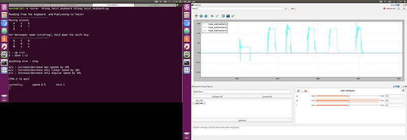
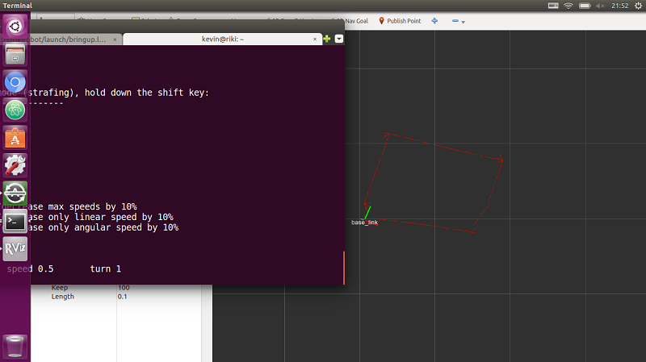
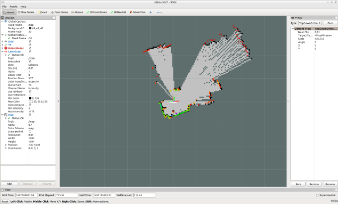
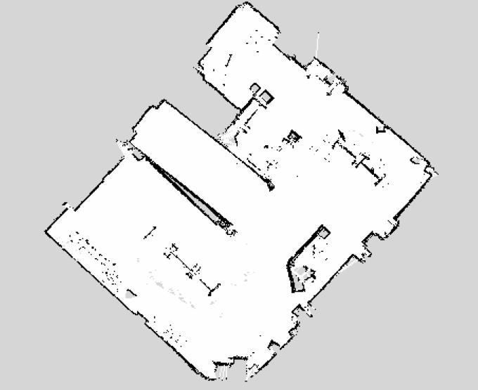

### RikiRobot实物  淘宝上可搜(RikiRobot)

### RikiRobot硬件配置

配件列表  |    机器人配置
---|---
机器人主板 | 树莓派3b 
激光雷达   | 思岚 Rpliar A1
机器人系统 | 树莓派ubuntu mate 16.04 
ROS系统    | 树莓派为 kinetic 
机器下位机控制板 |Arduino teensy3.1 + 驱动板 或者 stm32驱动板
陀螺仪  | GY-85 
电池    | 3S 2800mA
电机    | 大功率 330RPM 码盘精度390线
摄像头（选配）  | 树莓派为CSI摄像头，也可支持USB摄像头

### 一、使用前的系统准备
* 1.1、为了保证小车落地正常行走，也为了保证树莓派能有足够的运行算力，从某种意义上来说，树莓派3是完成ROS雷达SLAM的最低配置了，除了测试或者调试时，可以在树莓派上开图形，正常使用时请不要在树莓派上开图形系统，图形系统用hostmaster的方式来完成，也就是交给上位机电脑来运行，请准备一台ubuntu16.04安装了ROS系统的上位开发机电脑或者虚拟机，另Arduino或者stm32的环境也需要一台上位开发机，因此这个是必需的，对于第一次玩ROS或者对ROS不熟悉的用户，请直接用我提供的虚拟机，这样会减少不必要的麻烦与问题，以下操作都是在虚拟机进行下面操作。
* 1.2、树莓派系统的用户密码为：123456
* 1.3、用户虚拟机密码：123456
* 1.4、用户如果购买的stm32驱动板，对应的启动文件是stm32bringup.launch
* 1.5、启动前，请为树莓派准备一台HDMI显示器及HDMI线，和USB键鼠一套，连接好后启动树莓派，并设置连接树莓派的wifi。
* 1.6、测试电机转动时，如果小车没有落地或者有线束缚时，请把电机架空。

### 二、使用前的硬件与连接环境准备
* 2.1、检查好小车是否连接正常。  
* 2.2、关于陀螺仪的安装，带芯片的面一定要朝上，X方向朝前，Y方向朝左，拿到车的用户都已接好。
* 2.3、打开上位机电脑并连上网络，打开树莓派并连接上网络，检查网络的连通性，如果网络连通，则系统正常，如果不通请检查网络，如果相互能ping通ip，请打开虚拟机的用户.bashrc文件，进行ROS网络配置。
> $gedit ~/.bashrc  

请修改“export ROS_MASTER_URI=http://192.168.1.106:11311”，请把相关的IP(192.168.1.106)改成你当前树莓派主机的IP，请把“export RIKIBASE=2wd”,请把你的车型改成你手中的拿到的车型，2wd是系统默认，四驱改成（4wd）, 麦克纳姆轮改成（mecanum），omni全向三轮改成（omni），omni全向四轮改成（omni4wd），更改完成后重启系统，如果不会请参考网络配置视频。

### 三、启动Riki Robot系统
* 3.1、在Riki Robot（树莓派）端运行下在命令
> $ roslaunch rikirobot  bringup.launch

如果用户购买的是stm32的驱动板，则启动
> roslaunch rikirobot  stm32bringup.launch

如果启动异常，请检/dev/rikibase(如果是stm32驱动则是rikistm32base)设备是否存在，如果存在，请重新执行第一步。  
> $ ls /dev/rikibase

如果不存在，请查控制板与树莓派有没有连接好

* 3.2 在开发电脑端（虚拟机端）执行行键盘控制命令
> rosrun teleop_twist_keyboard teleop_twist_keyboard.py

如果上面都连接上，此时可用键盘来控制机器人。

### 四、rqt图形化PID校正
只要是收到的完整小车，整个调速都是经过店主简单的调试过的，这里用户想调整的更好，可利用rqt图形工具来找到满意的PID值
* 4.1、在Robot端运行下面命令
> $ roslaunch rikirobot  bringup.launch

运行PID配置节点
> rosrun riki_pid pid_configure

* 4.2、在开发电脑端执行行键盘控制命令  
> $ rosrun teleop_twist_keyboard teleop_twist_keyboard.py

* 4.3、打开rqt（请注意打开后请最大化，不然会找不到菜单栏）
> $rqt

* 4.4、加载pid图形配置文件 Perspective > Import 选择 ~/catkin_ws/src/riki_pid/riki_pid.perspective

* 4.5、通过上面调试用户得到最合适的PID值后，用户可以从我给的云盘资料下载rikirobot_2wdarduino.zip文件（其它车型或者stm32请对应源代码相关的文件目录），将此文件放入到ubuntu的虚拟机里面，然后打开 rikirobot_2wdarduino/lib/config/config.h文件更改相关的PID参数，然后编译烧写到控制板上，烧写前请将USB插入虚拟机上并连接上，进入到rikirobot_2wdarduino目录然后执行下面命令（对于stm32的用户请参考stm32烧写指导）。
> $ platformio run --target upload

### 五、里程信息
* 5.1、里程信用用于估计机器人相对于原点的位置，为了达到好的精度，Riki Robot使用了两个里程源，机器人的线速度是根据电机上的编码器来计算的，并将计算的结果发布到/raw_vel结点上，而机器人的角速度则通过陀螺仪来控制，通过AHRS算法通过imu_filter_madgwick包过滤掉来自IMU的噪声，滤波后的输出发布到/imu/data，为需要机器人结点可靠的IMU数据，下面是/raw_imu中的数据发布到/imu/data/上

* 5.2、在Robot端运行下面命令
> $ roslaunch rikirobot  bringup.launch

* 5.3、在开发电脑端执行行键盘控制命令  
> $ rosrun teleop_twist_keyboard teleop_twist_keyboard.py

* 5.4、在电脑端运行
> $ rosrun rviz rviz

然后打开 File > Open Config 然后选择 ~/catkin_ws/src/rikirobot_project/rikirobot/rviz/odometry.rviz.

* 5.5、旋转角度测试校准，按键盘的旋转键，旋转360度后，看rviz上的转动是不是也是360度，如下图：

* 5.6、路径测试，用键盘控制小车，进行移动，观查相关路径结果是否与实际一致，如下图测试,测试结果大致能闭合就行，要更精确的结果，后面会有AMCL、Move_base等算法包进行约束：

### 六、创建地图
创建地图，建图算法支持gmapping、hector算法，另外提供3种创建地图的方式，第一种是键盘创建地图，第二种是鼠标创建地图，第三种是通过选定区域自动创建地图。
* 6.1、 用键盘创建地图，在Robot端打开两个终端运行
> $ roslaunch rikirobot  bringup.launch  
$ roslanuch rikirobot lidar_slam.launch

* 6.2、 在电脑端运行
> $ rosrun teleop_twist_keyboard teleop_twist_keyboard.py

* 6.3、在电脑端运行
> $ rosrun rviz rviz

然后打开 File > Open Config 然后选择 ~/catkin_ws/src/rikirobot_project/rikirobot/rviz/slam.rviz.

然后用键盘控制小车，得到下面的显示，则是正常

* 6.4、控制小车行走到你认为地图创建好为止，然后在Robot端保存地图，运行下面命令，用户请注意，一定要按我下面的方法来保存地图，用户不能随意的更改地图路径与名称，对于将来对ROS熟悉后，用户就可以按自己的方式来保存地图。
> $rosrun map_server map_saver -f ~/catkin_ws/src/rikirobot_project/rikirobot/maps/house

* 6.4.1 关于保存地图的第二种方法，也是不会出错的方法，用户也可以进到maps目录下面，执行map.sh这种脚本，这样就可以确定，地图一定是保存在这个目录下面。
> $cd ~/catkin_ws/src/rikirobot_project/rikirobot/maps/  
$./map.sh

* 6.5 鼠标构图，同样按上面6.1操作，跳过6.2步骤启动rviz,此时请点击“2D Nav Goal",在地图空白区域，给定目标与方向，此时小车就会朝相关方向走，直到你构建地图完成，保存地图请执行6.4步骤

* 6.6 选定区域自动构建地图，同样按上面6.1操作，跳过6.2步骤
* 6.6.1 在电脑端运行
> $ rosrun rviz rviz

然后打开 File > Open Config 然后选择 ~/catkin_ws/src/rikirobot_project/rikirobot/rviz/auto_slam.rviz

* 6.6.2 当rviz加载正常后，点击上面的"Publish Point",然后放在地图上，这样重复操作形成一个封闭的行走区域，此时在小车坐标附近放置一个点，这时封闭区域消失，此时小车就会自己行走，直到你创建的封闭区域行走完成，如果此时创建的地图你比较满意，你就按步骤6.4操作保存地图，如果不满意，或者未完成，可以再次设定区域，让小车自己探索，直到完成为止，如果用户不会操作，请看群里的创建地图的演示视频。

* 6.7、检查地图
> $cd ~/catkin_ws/src/rikirobot_project/rikirobot/maps  
$ls -a house.pgm house.yaml

### 七、自动导航
* 7.1、在Robot端打开两个终端运行
> $ roslaunch rikirobot  bringup.launch  
$ roslanuch rikirobot navigate.launch

* 7.2、在电脑端运行
> $ rosrun rviz rviz  
然后打开 File > Open Config 然后选择 ~/catkin_ws/src/rikirobot_project/rikirobot/rviz/navigate.rviz

* 7.3、设置导航，并发送目标，如果小车启动后，动态地图与静态地图一致时，可以按下面操作，如果动态地图与静态地图不一致时，表示小车用AMCL算法自主定位失败，请参考8.6的解决办法。
 * 7.3.1、单击“2D Nav Goal”，并在地图的可视区域里设置好目标位置

### 八、关于可能的问题与解决办法
* 8.1 打开rviz时，发现机器人的坐标系箭头一直在抖动。
> 请校调你手中的陀螺仪

* 8.2 如果里程计中里程量与角速度不准，怎么办？
> 请参考角速度与线速度校正视频

* 8.3 打开rviz时，发现机器人的坐标系不动或者里程反馈异常,或者你的矩阵数值Z值异常
> 请检查陀螺仪是否插好

* 8.4 SLAM导航时执行不动，或者乱转
> 1、请检查你的地图是否有正常加载  
2、创建地图时请保证有一定的行驶空间，导航要点请参考导航视频

* 8.5 激光雷达运行报错，请检查电池电量是否充足，在次重启后再启动试一下，如果充足，重启系统后都会报错，请按下面执行
> 请执行 $ sudo chmod +x /dev/ttyUSB0  
$ sudo chmod +x /dev/rikilidar

* 8.6 如果导航时，报下面的警告，请保证你的网络带宽是足够的，出现这个问题是由于全局地图与本地地图在网络上同步不一致所致。
> [ WARN] [1339438850.439571557]: Costmap2DROS transform
timeout. Current time: 1339438850.4395, global_pose stamp:
1339438850.3107, tolerance: 0.0001

* 8.7 如果开启导航时，发现静态地图与机器人的定位的动态膨胀的动态地图不一致怎么办？
> 这个问题是由于机器人启动导航时进行AMCL定位时失败所致，也就是自己进行位姿估计失败，解决办法是通过点击“2D Pose Estimate”对机器人进行重新定位，直到与静态地图一致，特别注意，如果在动态与静态地图不一致的情况下，执行导航，发送目标位置，小车导航是不可能成功的，这样导航时会出现各种情况的警告或者错误。因此在动静态地图不一致的情况，给机器人重新指定位姿是必须的。

* 8.8 如果导航时，小车突然失去了方向或者乱转可能的原因
> 请检检查相关后台，后台如果出现导航相关的警告或者错误都会出现上述原因，出现的原因很多，这里就不一一分析，请自行对照ROS维基、百度、谷歌进行查找，从实际导航效果来看，只有后台不出现警告或者错误，导航是会成功的，当然导航过程出现一点的偏差，也不要以为有问题，从目前的硬件来看电机与编码器是最低成本的小车，当运行一段时间后就会有累计误差，IMU的抖动累计也有影响，这都对导航的最终效果出现偏差有影响，此平台也只是学习与研究平台。

* 8.9 如果虚拟机端运行rviz出现闪退。
> 可以参考我提供虚拟机文件里面的视频资料自行建立rviz，另外rviz是可以自己保存的，不用每次都建一次。

* 8.10 使用过程种，电机不转，或者电机无力
> 请保证电池电量充足，电池最高电压为12.6V，因此，电压下降到一定程度后，电池就带不动电机负载。

